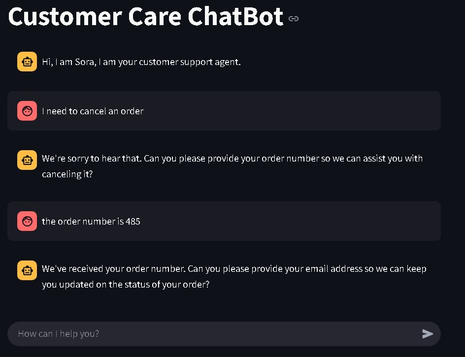

# Customer Support Agent

## Table of Contents

- [Model](#model)
- [FineTuning](#finetuning)
- [Deployment](#deployment)

## Model
For the Chatbot we used the gemma 2 2B model.
The model 2B is selected for the following reasons.
* **Applications with strict latency requirements:**
    Ideal for real-time interactions, chatbots, and systems where quick responses are crucial.
* **Deployment on resource-constrained devices:**
    Suitable for edge devices, mobile phones, and embedded systems with limited processing power and memory.
* **Fine-tuning for niche domains:**
    Easily adaptable to specific industries or tasks with limited datasets, enabling customized AI solutions.
* **Prototyping and experimentation:**
    Facilitates rapid development and testing of NLP applications due to faster training and inference times.
* **When cost effectiveness is a high priority:**
    Reduces hardware and energy costs compared to larger models, making AI more accessible and affordable.

## Finetuning
The model was finetuned on a Google Colab using the T4 GPU
### If you are interested in learning how to fine tune a model on custom dataset

I have written an article on this  [Read More](https://medium.com/@makewithrex/fine-tuning-a-llm-model-for-beginners-a16614a68d01).

## Deployment
The model has been deployed on HuggingFace Space.
 
[Try it Here](https://huggingface.co/spaces/Prajjwalng/customercare)

